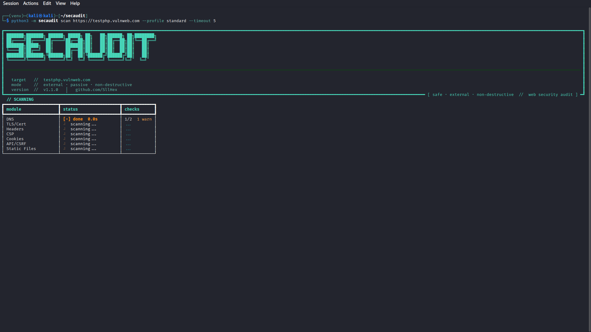
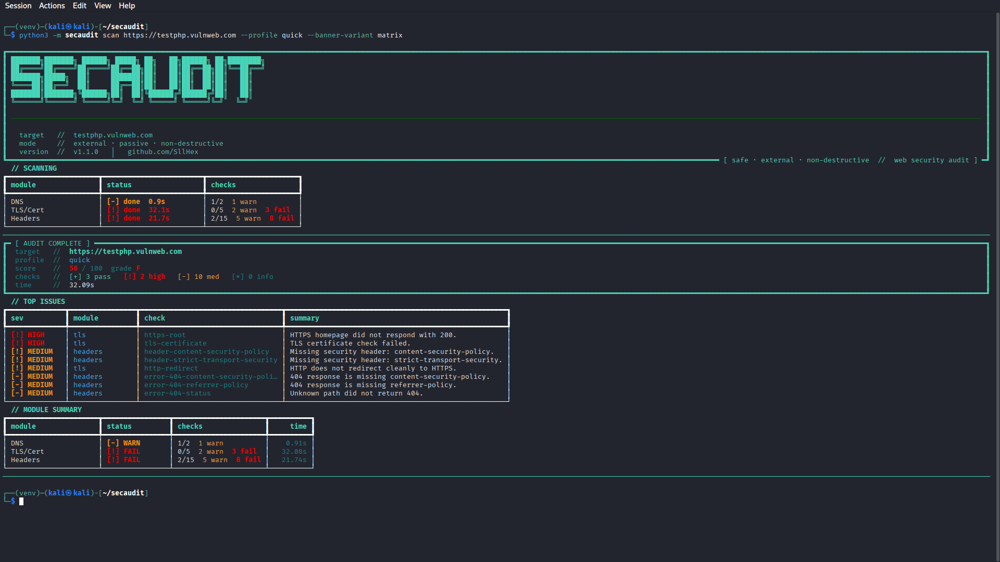
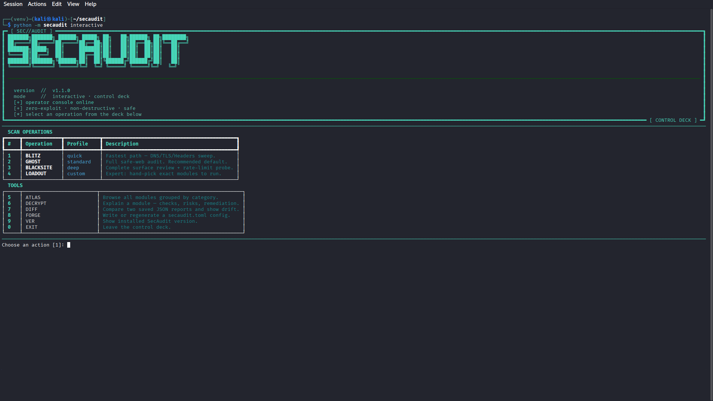

```
███████╗███████╗ ██████╗ █████╗ ██╗   ██╗██████╗ ██╗████████╗
██╔════╝██╔════╝██╔════╝██╔══██╗██║   ██║██╔══██╗██║╚══██╔══╝
███████╗█████╗  ██║     ███████║██║   ██║██║  ██║██║   ██║
╚════██║██╔══╝  ██║     ██╔══██║██║   ██║██║  ██║██║   ██║
███████║███████╗╚██████╗██║  ██║╚██████╔╝██████╔╝██║   ██║
╚══════╝╚══════╝ ╚═════╝╚═╝  ╚═╝ ╚═════╝ ╚═════╝╚═╝   ╚═╝
```

<p align="center">
  
  
  
  
  
  
</p>

<p align="center"><b>safe · external · non-destructive // web security audit</b></p>

---

**SecAudit** is a hacker-aesthetic Python CLI for **safe external security auditing** of public-facing web applications.

Zero exploits. Zero brute-force. Pure posture review — TLS, headers, CSP, cookies, API behavior, DNS, JavaScript exposure, proxy-cache hygiene — all running in **parallel** with a Rich terminal UI that looks as sharp as the analysis it delivers.

---

## // SCREENSHOTS

> **Add screenshots here** — capture your terminal after running SecAudit and drop the images in `docs/screenshots/`. See [`docs/screenshots/README.md`](docs/screenshots/README.md) for guidance.

### Banner + Scan Start


> *Replace with actual screenshot: `secaudit scan https://yoursite.com --banner-variant matrix`*

### Live Scan Progress



> *Replace with actual screenshot: scan in progress, mid-run progress table visible*

### Audit Complete — Score, Grade, Top Issues



> *Replace with actual screenshot: `[ AUDIT COMPLETE ]` panel showing score, grade, top issues table, module summary*

### Interactive Control Deck



> *Replace with actual screenshot: `secaudit interactive` — Control Deck splash + menu*

### Diff Mode


> *Replace with actual screenshot: `secaudit compare baseline.json current.json`*

---

## // INSTALL

**From source (recommended):**

```bash
git clone https://github.com/your-org/secaudit.git
cd secaudit
python3 -m venv .venv && source .venv/bin/activate
pip install -r requirements.txt
```

**Editable dev install (with linter + test deps):**

```bash
pip install -e .[dev]
```

**Run without installing:**

```bash
python -m secaudit scan https://example.com
```

---

## // QUICK START

```bash
# Full safe-web audit (standard profile — recommended)
secaudit scan https://example.com

# Fast sweep — DNS, TLS, Headers only
secaudit scan https://example.com --profile quick

# Complete audit — everything including JS, email DNS, proxy probes
secaudit scan https://example.com --profile deep

# Interactive Control Deck — no flags needed
secaudit interactive
```

---

## // HOW IT WORKS

SecAudit runs every module in **parallel** using `asyncio.gather`, so a full `deep` profile audit of 10 modules completes in roughly the time of the slowest single module — not 10× slower.

Shared state (fetched homepage, HTTP root response) is **memoized with async locks**, so multiple modules that need the same HTTP response pay for it only once with no race conditions.

```
target URL
    │
    ▼
AuditContext (memoized fetches, async-safe locks)
    │
    ├── Module: dns        ─┐
    ├── Module: tls         │  asyncio.gather  →  parallel
    ├── Module: headers     │
    ├── Module: csp        ─┘
    │         ...
    ▼
AuditReport  →  score / grade / top issues
    │
    ├── Terminal (Rich live progress + final summary)
    ├── JSON report
    └── HTML report
```

---

## // TERMINAL OUTPUT

**Live progress** (updates every 100ms during scan):

```
  // SCANNING
┏━━━━━━━━━━━━━━━━━━━━━━┳━━━━━━━━━━━━━━━━━━━━━━━┳━━━━━━━━━━━━━━━━━━━━━━┓
┃ module               ┃ status                ┃ checks               ┃
┡━━━━━━━━━━━━━━━━━━━━━━╇━━━━━━━━━━━━━━━━━━━━━━━╇━━━━━━━━━━━━━━━━━━━━━━┩
│ DNS                  │ [+] done  0.3s        │ 4/4                  │
│ TLS                  │ [+] done  0.5s        │ 7/7                  │
│ Headers              │ ⠋ scanning...         │ ...                  │
│ CSP                  │ [ ] queued            │ ─                    │
│ Cookies              │ [ ] queued            │ ─                    │
└──────────────────────┴───────────────────────┴──────────────────────┘
```

**Final report:**

```
━━━━━━━━━━━━━━━━━━━━━━━━━━━━━━━━━━━━━━━━━━━━━━━━━━━━━━━━━━━━━━━━━━━
┏━ [ AUDIT COMPLETE ] ━━━━━━━━━━━━━━━━━━━━━━━━━━━━━━━━━━━━━━━━━━━━━┓
┃   target   //  example.com                                        ┃
┃   profile  //  standard                                           ┃
┃   score    //  74 / 100  grade  C+                                ┃
┃   checks   //  [+] 38 pass  [!] 3 high  [-] 5 med  [*] 2 info    ┃
┃   time     //  2.14s                                              ┃
┗━━━━━━━━━━━━━━━━━━━━━━━━━━━━━━━━━━━━━━━━━━━━━━━━━━━━━━━━━━━━━━━━━━━┛

  // TOP ISSUES
┏━━━━━━━━━━━━━━┳━━━━━━━━━━┳━━━━━━━━━━━━━━━━━━━━━━━━━━┳━━━━━━━━━━━━━━━━━━━━━━━━━━━━━━━━━━━━┓
┃ sev          ┃ module   ┃ check                    ┃ summary                            ┃
┡━━━━━━━━━━━━━━╇━━━━━━━━━━╇━━━━━━━━━━━━━━━━━━━━━━━━━━╇━━━━━━━━━━━━━━━━━━━━━━━━━━━━━━━━━━━━┩
│ [!] HIGH     │ headers  │ hsts-missing             │ HSTS header absent                 │
│ [!] HIGH     │ csp      │ csp-unsafe-inline        │ CSP allows unsafe-inline scripts   │
│ [-] MEDIUM   │ cookies  │ cookie-samesite          │ Session cookie missing SameSite    │
└──────────────┴──────────┴──────────────────────────┴────────────────────────────────────┘
```

---

## // INTERACTIVE CONTROL DECK

```bash
secaudit interactive
```

```
┏━ [ SEC//AUDIT ] ━━━━━━━━━━━━━━━━━━━━━━━━━━━━━━━━━━━━━━━━━━━━━━━━━┓
┃   ╔══════════════════════════════════════════════╗               ┃
┃   ║    ░░  S E C // A U D I T  ░░               ║               ┃
┃   ║    CONTROL DECK  ─────────────  v1.1.0        ║              ┃
┃   ╚══════════════════════════════════════════════╝               ┃
┃   [+] operator console online                                    ┃
┃   [+] surface audit engine loaded                                ┃
┃   [+] zero-exploit · non-destructive · safe                      ┃
┃   [*] select an operation from the deck below                    ┃
┗━━━━━━━━━━━━━━━━━━━━━━━━━━━━━━━━━━━━━━━━━━━━━━━━━━━━━━━━━━━━━━━━━━┛

  SCAN OPERATIONS
┏━━━┳━━━━━━━━━━━━━┳━━━━━━━━━━┳━━━━━━━━━━━━━━━━━━━━━━━━━━━━━━━━━━━━━━━━━━━┓
┃ # ┃ Operation   ┃ Profile  ┃ Description                               ┃
┡━━━╇━━━━━━━━━━━━━╇━━━━━━━━━━╇━━━━━━━━━━━━━━━━━━━━━━━━━━━━━━━━━━━━━━━━━━━┩
│ 1 │ BLITZ       │ quick    │ Fastest path — DNS/TLS/Headers sweep.     │
│ 2 │ GHOST       │ standard │ Full safe-web audit. Recommended default. │
│ 3 │ BLACKSITE   │ deep     │ Complete surface review + rate-limit.     │
│ 4 │ LOADOUT     │ custom   │ Expert: hand-pick exact modules to run.   │
└───┴─────────────┴──────────┴───────────────────────────────────────────┘
  TOOLS
┌───┬─────────────┬────────────────────────────────────────────────────────┐
│ 5 │ ATLAS       │ Browse all modules grouped by category.                │
│ 6 │ DECRYPT     │ Explain a module — checks, risks, remediation.         │
│ 7 │ DIFF        │ Compare two saved JSON reports and show drift.         │
│ 8 │ FORGE       │ Write or regenerate a secaudit.toml config.            │
│ 9 │ VER         │ Show installed SecAudit version.                       │
│ 0 │ EXIT        │ Leave the control deck.                                │
└───┴─────────────┴────────────────────────────────────────────────────────┘
```

---

## // SCAN PROFILES

| Profile    | Alias       | Modules included                                       | Speed    |
|------------|-------------|--------------------------------------------------------|----------|
| `quick`    | BLITZ       | `dns` · `tls` · `headers`                              | ~1–2s    |
| `standard` | GHOST       | + `csp` · `cookies` · `api` · `static`                 | ~2–5s    |
| `deep`     | BLACKSITE   | + `javascript` · `email_dns` · `proxy_cache`           | ~4–10s   |

---

## // MODULES

```bash
secaudit modules          # grouped overview of every module
secaudit explain tls      # deep-dive: checks, risks, remediation
secaudit explain csp
```

| Slug          | Category     | What it checks                                        |
|---------------|--------------|-------------------------------------------------------|
| `dns`         | Core         | DNSSEC, www-redirect correctness, resolver hygiene    |
| `tls`         | Core         | Cert expiry, HTTPS redirect, HSTS, cipher suites      |
| `headers`     | Web App      | HSTS, X-Frame-Options, CSP presence, Referrer-Policy  |
| `csp`         | Web App      | Policy quality, `unsafe-inline`, script-src strictness|
| `cookies`     | Web App      | Secure, HttpOnly, SameSite, `__Host-` / `__Secure-`   |
| `static`      | Web App      | Exposed dotfiles, directory listing, robots.txt        |
| `api`         | API          | CORS, CSRF, verb tampering, 401/403 response quality  |
| `email_dns`   | DNS / Email  | SPF, DKIM, DMARC presence and policy strictness       |
| `javascript`  | Advanced     | Inline event handlers, `eval`, source-map exposure    |
| `proxy_cache` | Advanced     | Cache-Control, Vary, CDN / proxy header hygiene       |

---

## // CLI REFERENCE

```bash
# Scanning
secaudit scan https://example.com                        # standard profile
secaudit scan https://example.com --profile quick        # fast sweep
secaudit scan https://example.com --profile deep         # full audit
secaudit scan https://example.com --only tls,headers,csp # custom module set
secaudit scan https://example.com --skip js,api          # exclude modules
secaudit scan https://example.com --verbose              # all check details
secaudit scan https://example.com --watch 5              # re-run every 5 min

# Output
secaudit scan https://example.com --json out.json
secaudit scan https://example.com --html out.html
secaudit scan https://example.com --json out.json --html out.html

# CI
secaudit scan https://example.com --ci
secaudit scan https://example.com --ci --fail-on high

# Banner variants
secaudit scan https://example.com --banner-variant matrix
secaudit scan https://example.com --banner-variant stealth
secaudit scan https://example.com --banner-variant ghost
secaudit scan https://example.com --banner-variant minimal

# Other commands
secaudit interactive                      # operator control deck
secaudit compare before.json after.json   # diff two saved reports
secaudit modules                          # list all modules
secaudit explain csp                      # explain a single module
secaudit init                             # generate secaudit.toml
secaudit version                          # print version
```

### Useful flags

| Flag | Effect |
|------|--------|
| `--profile` | `quick` / `standard` / `deep` |
| `--only` | Comma-separated module allowlist |
| `--skip` | Comma-separated modules to exclude |
| `--verbose` | Print per-check finding details |
| `--quiet` | One-line summary only |
| `--ci` | Exit non-zero on any FAIL |
| `--fail-on` | `critical` / `high` / `medium` / `low` / `info` |
| `--watch N` | Re-run every N minutes, show drift |
| `--no-banner` | Suppress banner |
| `--no-color` | Disable colors |

---

## // BANNER VARIANTS

| Variant    | Style                                                 |
|------------|-------------------------------------------------------|
| `matrix`   | Full ANSI-shadow block wordmark + green metadata      |
| `stealth`  | Compact two-line mark, cyan accent border             |
| `ghost`    | Simulated shell prompt — `root@secaudit:~#`           |
| `minimal`  | Single-line, no box, borderless — CI-friendly         |

---

## // CI INTEGRATION

```yaml
# .github/workflows/security.yml
name: SecAudit

on:
  push:
    branches: [main]
  schedule:
    - cron: "0 3 * * 1"   # Weekly Monday 03:00 UTC

jobs:
  audit:
    runs-on: ubuntu-latest
    steps:
      - uses: actions/checkout@v4

      - name: Set up Python
        uses: actions/setup-python@v5
        with:
          python-version: "3.12"

      - name: Install SecAudit
        run: pip install -r requirements.txt

      - name: Run audit
        run: |
          secaudit scan ${{ vars.TARGET_URL }} \
            --profile deep \
            --json reports/secaudit.json \
            --ci \
            --fail-on high

      - name: Upload report
        uses: actions/upload-artifact@v4
        with:
          name: secaudit-report
          path: reports/
```

**Exit codes:**

| Code | Meaning |
|------|---------|
| `0` | Clean — no findings at or above `--fail-on` level |
| `1` | Issues found at or above the threshold |
| `2` | Scan error or misconfiguration |

---

## // DIFF MODE

Track posture drift between two scan runs:

```bash
secaudit scan https://example.com --json baseline.json

# ... after deploying changes ...

secaudit scan https://example.com --json current.json
secaudit compare baseline.json current.json
```

```
┏━ [ DIFF ] ━━━━━━━━━━━━━━━━━━━━━━━━━━━━━━━━━━━━━━━━━━━━━━━━━━━━━━━┓
┃   score   //  72 → 81  (+9)                                       ┃
┃   grade   //  C+ → B                                              ┃
┃   changes //  [!] 4 changed   [+] 2 added   [-] 1 removed         ┃
┗━━━━━━━━━━━━━━━━━━━━━━━━━━━━━━━━━━━━━━━━━━━━━━━━━━━━━━━━━━━━━━━━━━━┛
```

---

## // CONFIGURATION

```bash
secaudit init            # write starter secaudit.toml
secaudit init --force    # overwrite existing
```

```toml
# secaudit.toml — all CLI flags can be set here
target         = "https://example.com"
profile        = "standard"
only           = []
skip           = []
output         = ["terminal", "json", "html"]
report_dir     = "reports"
fail_on        = "high"
timeout        = 10
user_agent     = "SecAudit/1.1.0"
check_www      = false
banner         = true
banner_variant = "matrix"   # matrix | stealth | ghost | minimal
color          = true
quiet          = false
verbose        = false
json           = "secaudit-report.json"
html           = "secaudit-report.html"
```

Precedence: **CLI flags > secaudit.toml > defaults**

If you run `secaudit scan` without a URL and `secaudit.toml` has a `target` set, that target is used automatically.

---

## // ARCHITECTURE

```
secaudit/
├── cli.py          ← Click entry points, interactive deck, display helpers
├── engine.py       ← Async parallel module executor (asyncio.gather)
├── context.py      ← Shared scan state, async-safe memoized HTTP fetches
├── http.py         ← Async HTTP client (aiohttp wrapper)
├── models.py       ← CheckResult, ModuleRun, AuditReport, AuditDiff
├── scoring.py      ← Score calculation and letter-grade assignment
├── profiles.py     ← Profile definitions (quick / standard / deep)
├── registry.py     ← Module registry, slug resolution, grouped listing
├── config.py       ← secaudit.toml loading, validation, precedence merging
├── diff.py         ← Report comparison logic
├── modules/
│   ├── dns.py          Core — DNSSEC, www-redirect
│   ├── tls.py          Core — cert expiry, cipher, HSTS
│   ├── headers.py      Web App — browser security headers
│   ├── csp.py          Web App — Content Security Policy
│   ├── cookies.py      Web App — cookie attribute hygiene
│   ├── static.py       Web App — exposed files, directory listing
│   ├── api.py          API — CORS, CSRF, verb tampering
│   ├── email_dns.py    DNS/Email — SPF, DKIM, DMARC
│   ├── javascript.py   Advanced — JS exposure, eval, source maps
│   └── proxy_cache.py  Advanced — Cache-Control, CDN headers
├── reporters/
│   └── terminal.py ← Rich live progress + final report renderer
└── ui/
    ├── banner.py       4 banner variants
    ├── interactive.py  Control Deck splash + menu builder
    └── tables.py       Reusable Rich table builders
```

Adding a new module = drop a file in `modules/`, register it in `registry.py`, done. Zero changes to the engine or CLI.

---

## // RESPONSIBLE USAGE

SecAudit is scoped to **safe, passive, external auditing only**.

It does **not**:
- brute-force credentials or endpoints
- bypass access controls or WAFs
- exploit vulnerabilities
- trigger denial-of-service conditions
- run destructive fuzzing or injection payloads

Only run it against systems you own or are **explicitly authorized** to assess.

---

## // ROADMAP

- [ ] SARIF output for GitHub Code Scanning integration
- [ ] Baseline / ignore files for CI regression suppression
- [ ] Per-finding remediation guidance with CVE / reference links
- [ ] Plugin discovery via entry points
- [ ] Profile-aware scoring for mail-less / proxy-light targets
- [ ] Deeper CSP and JavaScript analysis passes
- [ ] HTML report dark-mode redesign

---

## // CONTRIBUTING

Pull requests welcome — especially:

- new safe external modules
- false-positive reduction in existing modules
- tests and fixtures
- report output polish

See [CONTRIBUTING.md](CONTRIBUTING.md) · [SECURITY.md](SECURITY.md) · [CODE_OF_CONDUCT.md](CODE_OF_CONDUCT.md)

---

## // LICENSE

MIT — see [LICENSE](LICENSE)
